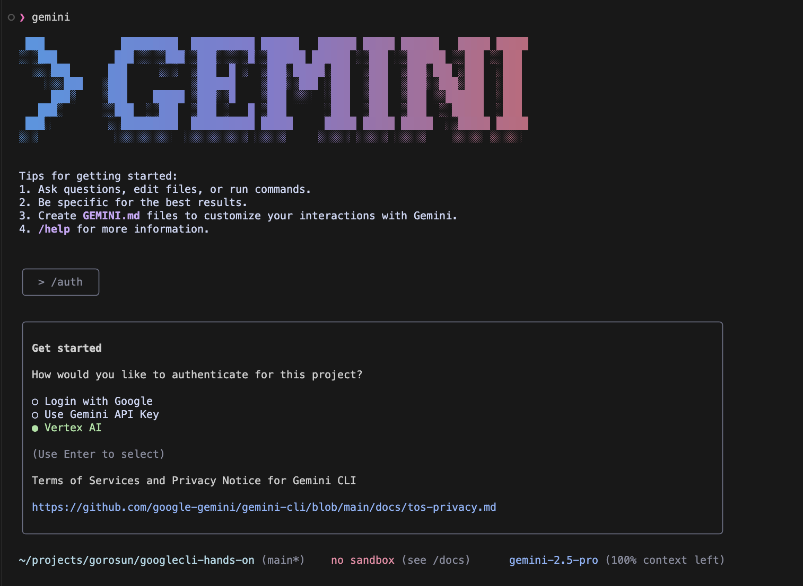

# Gemini CLI インストールと設定ガイド

## 概要

Gemini CLI は、Google がオープンソースでリリースした AI エージェントで、ターミナルから直接 Gemini の機能にアクセスできます。このガイドでは、Gemini CLI のインストールから Vertex AI との統合設定まで詳しく説明します。

## 目次

1. [前提条件](#前提条件)
2. [Gemini CLI について](#gemini-cliについて)
3. [インストール手順](#インストール手順)
4. [初期設定](#初期設定)
5. [Vertex AI との統合](#vertex-aiとの統合)
6. [基本的な使用方法](#基本的な使用方法)
7. [高度な設定](#高度な設定)
8. [トラブルシューティング](#トラブルシューティング)
9. [参考資料](#参考資料)

## 前提条件

### 必要なソフトウェア

- **Node.js**: バージョン 18.0.0 以上
- **npm**: Node.js に付属
- **Git**: バージョン管理用
- **Google Cloud SDK**: Vertex AI 連携用（オプション）

### アカウント要件

- **Google アカウント**: Gemini API 使用のため
- **Google Cloud アカウント**: Vertex AI 使用のため（有料プラン推奨）
- **API キー**: Google AI Studio または Vertex AI 経由

### システム要件

- **OS**: macOS, Linux, Windows
- **メモリ**: 最低 2GB、推奨 4GB 以上
- **ディスク容量**: 500MB 以上の空き容量

## Gemini CLI について

### 主な機能

- **ターミナル統合**: コマンドラインから直接 Gemini とやり取り
- **マルチモーダル対応**: テキスト、画像、コードの処理
- **リアルタイム検索**: `@search`ツールによる最新情報取得
- **コード理解**: プロジェクト全体の解析と支援
- **タスク自動化**: 繰り返し作業の自動化

### アーキテクチャ

```
┌─────────────────┐    ┌──────────────────┐    ┌─────────────────┐
│   Gemini CLI    │────│  Gemini API      │────│  Vertex AI      │
│   (ローカル)      │    │  (Google AI)     │    │  (Google Cloud) │
└─────────────────┘    └──────────────────┘    └─────────────────┘
```

## インストール手順

### 1. 環境の確認

```bash
# Node.jsバージョン確認
node --version
# 結果例: v20.11.0

# npmバージョン確認
npm --version
# 結果例: 10.2.4
```

### 2. Gemini CLI のインストール

#### 方法 A: NPM グローバルインストール（推奨）

```bash
# Gemini CLIをグローバルにインストール
npm install -g @google-gemini/gemini-cli

# インストール確認
gemini --version
```

#### 方法 B: NPX による実行

```bash
# NPXで直接実行（インストール不要）
npx @google-gemini/gemini-cli --help
```

#### 方法 C: GitHub から直接インストール

```bash
# GitHubリポジトリをクローン
git clone https://github.com/google-gemini/gemini-cli.git
cd gemini-cli

# 依存関係のインストール
npm install

# グローバルリンク
npm link
```

### 3. インストール確認

```bash
# バージョン確認
gemini --version

# 利用可能なコマンド一覧
gemini --help

# セッションから抜ける方法
/quit
# または
exit
# または Ctrl+C
```

## 初期設定

### 1. 認証設定

#### 🔑 重要：認証方法の違い

**Google AI Studio 使用の場合：**

- `GEMINI_API_KEY`が必要
- Google AI Studio から個人用 API キーを取得

**Vertex AI 使用の場合：**

- `GEMINI_API_KEY`は**不要**
- `GOOGLE_APPLICATION_CREDENTIALS`（サービスアカウントキー）を使用
- `GOOGLE_CLOUD_PROJECT`でプロジェクトを指定

#### Google AI Studio API キーの場合（個人開発向け）

1. [Google AI Studio](https://makersuite.google.com/)にアクセス
2. 「Get API Key」をクリック
3. 新しい API キーを作成

```bash
# APIキーを環境変数に設定
export GEMINI_API_KEY="your_api_key_here"

# または設定ファイルに保存
gemini configure --api-key "your_api_key_here"
```

#### Vertex AI 認証の場合（企業・本格開発向け）

**当プロジェクトの設定例（`.env`ファイルより）：**

```bash
# 環境変数確認（既存設定を活用）
export GOOGLE_APPLICATION_CREDENTIALS="/Users/gorosun/.gcp/gemini-api-service-key.json"
export GOOGLE_CLOUD_PROJECT="gemini-api-service-466014"
export GOOGLE_CLOUD_LOCATION="us-central1"
```

**Gemini CLI で Vertex AI 設定：**

```bash
# Vertex AIプロバイダーを明示的に指定
gemini configure --provider vertex-ai \
  --project "$GOOGLE_CLOUD_PROJECT" \
  --location "$GOOGLE_CLOUD_LOCATION"

# 設定確認
gemini config show
```

**認証準備：**

```bash
# Google Cloud Application Default Credentialsでのログイン（Vertex AI使用時）
gcloud auth application-default login
```

**認証テスト：**

```bash
# Google Cloud認証確認
gcloud auth list

# プロジェクトアクセス確認
gcloud projects describe $GOOGLE_CLOUD_PROJECT

# Vertex AI API有効化確認
gcloud services list --enabled | grep aiplatform
```

#### Gemini CLI 起動（環境変数で認証設定済みの場合）

```bash
gemini
```

**Vertex AI 認証（CLI から実行）：**

Gemini CLI を起動後、`/auth`コマンドで Vertex AI 認証を行うことができます：



### 2. 設定ファイルの確認

```bash
# 設定ファイルの場所確認
gemini config --show-path

# 現在の設定表示
gemini config --show
```

### 3. 初回テスト

```bash
# 簡単なテスト
gemini chat "Hello, Gemini CLI!"

# ストリーミングテスト
gemini stream "Explain what you can do"
```

## Vertex AI との統合

### 1. 既存の Vertex AI 設定確認

当プロジェクトの既存設定を確認：

```bash
# 環境変数確認
echo $GOOGLE_CLOUD_PROJECT
echo $GOOGLE_APPLICATION_CREDENTIALS

# .envファイル確認
cat .env
```

### 2. Gemini CLI で Vertex AI 使用

```bash
# Vertex AIプロバイダーを明示的に指定
gemini configure --provider vertex-ai \
  --project "$GOOGLE_CLOUD_PROJECT" \
  --location "us-central1"

# Vertex AI経由でチャット
gemini chat --provider vertex-ai "Vertex AI経由でのテストメッセージ"
```

### 3. 設定ファイルの統合

`~/.gemini/config.json` を編集：

```json
{
  "default_provider": "vertex-ai",
  "providers": {
    "vertex-ai": {
      "project_id": "your-project-id",
      "location": "us-central1",
      "model": "gemini-1.5-pro"
    },
    "ai-studio": {
      "api_key": "your-api-key"
    }
  },
  "preferences": {
    "streaming": true,
    "temperature": 0.7,
    "max_tokens": 2048
  }
}
```

## 基本的な使用方法

### 1. チャット機能

```bash
# 基本的なチャット
gemini chat "TypeScriptのベストプラクティスを教えて"

# 対話モード
gemini interactive

# ファイルを含むチャット
gemini chat --file index.ts "このコードを改善してください"
```

### 2. コード分析

```bash
# プロジェクト全体の分析
gemini analyze .

# 特定ファイルの分析
gemini analyze index.ts

# コードレビュー
gemini review --files "*.ts"
```

### 3. ドキュメント生成

```bash
# README生成
gemini generate-docs --type readme

# API ドキュメント生成
gemini generate-docs --type api --input "*.ts"

# コメント追加
gemini add-comments --file index.ts
```

### 4. 検索機能

```bash
# リアルタイム検索
gemini search "最新のVertex AI機能"

# ローカル検索
gemini search-local "Vertex AI" --path docs/
```

## 高度な設定

### 1. カスタムプロンプト

`~/.gemini/prompts/` ディレクトリにカスタムプロンプトを作成：

```bash
# カスタムプロンプトディレクトリ作成
mkdir -p ~/.gemini/prompts

# TypeScript専用プロンプト
cat > ~/.gemini/prompts/typescript-expert.md << 'EOF'
あなたはTypeScriptの専門家です。
- 型安全性を重視してください
- 最新のTypeScript機能を活用してください
- パフォーマンスを考慮してください
- エラーハンドリングを適切に実装してください
EOF
```

使用方法：

```bash
gemini chat --prompt typescript-expert "このコードを改善してください" --file index.ts
```

### 2. プロジェクト固有の設定

プロジェクトルートに `.gemini.config.json` を作成：

```json
{
  "project_name": "googlecli-hands-on",
  "language": "typescript",
  "framework": "node",
  "coding_style": {
    "indent": 2,
    "quotes": "single",
    "semicolons": true
  },
  "excluded_files": ["node_modules/**", "dist/**", "*.log"],
  "custom_instructions": [
    "Google Cloud Vertex AIを使用したプロジェクト",
    "日本語でのドキュメント作成を重視",
    "エンタープライズレベルのセキュリティを考慮"
  ]
}
```

### 3. ワークフロー自動化

```bash
# デイリータスクの自動化
gemini workflow create daily-review \
  --tasks "analyze,review,test,document" \
  --schedule "0 9 * * *"

# CI/CD統合
gemini workflow create pre-commit \
  --tasks "lint,test,security-check" \
  --trigger "pre-commit"
```

## トラブルシューティング

### よくある問題と解決策

#### 1. インストールエラー

**問題**: `npm install -g @google/gemini-cli` でエラー

```bash
# Node.jsバージョン確認
node --version

# npmキャッシュクリア
npm cache clean --force

# 権限問題の場合（macOS/Linux）
sudo npm install -g @google/gemini-cli
```

#### 2. 認証エラー

**問題**: `Authentication failed` エラー

```bash
# APIキー確認
echo $GEMINI_API_KEY

# Google Cloud認証確認
gcloud auth list

# 認証再設定
gcloud auth application-default login
gemini configure --reset
```

#### 3. Vertex AI 接続エラー

**問題**: Vertex AI に接続できない

```bash
# プロジェクトID確認
gcloud config get-value project

# Vertex AI API有効化確認
gcloud services list --enabled | grep vertex

# API有効化
gcloud services enable aiplatform.googleapis.com
```

#### 4. 権限エラー

**問題**: `Permission denied` エラー

```bash
# サービスアカウント権限確認
gcloud projects get-iam-policy $GOOGLE_CLOUD_PROJECT

# 必要な権限追加
gcloud projects add-iam-policy-binding $GOOGLE_CLOUD_PROJECT \
  --member="serviceAccount:your-service-account@project.iam.gserviceaccount.com" \
  --role="roles/aiplatform.user"
```

### ログとデバッグ

```bash
# デバッグモード有効化
export GEMINI_DEBUG=true

# 詳細ログ出力
gemini chat "test" --verbose

# ログファイル確認
tail -f ~/.gemini/logs/gemini.log
```

### パフォーマンス最適化

```bash
# キャッシュ設定
gemini config set cache.enabled true
gemini config set cache.ttl 3600

# 並列処理設定
gemini config set concurrency.max_requests 5

# メモリ使用量制限
gemini config set memory.max_mb 1024
```

## セキュリティ考慮事項

### 1. API キー管理

- 環境変数での保存を推奨
- `.gitignore` で API キーファイルを除外
- 定期的な API キーローテーション

### 2. データプライバシー

- ローカルファイルの送信前確認
- 機密情報のフィルタリング設定
- ログファイルの定期クリーンアップ

### 3. 企業環境での使用

```bash
# プロキシ設定
export HTTPS_PROXY=https://your-proxy:8080
export HTTP_PROXY=http://your-proxy:8080

# SSL証明書設定
export NODE_EXTRA_CA_CERTS=/path/to/corporate-ca.pem
```

## 統合例

### 当プロジェクトでの活用例

```bash
# 既存のTypeScriptコード分析
gemini analyze index.ts --provider vertex-ai

# ドキュメント更新支援
gemini generate-docs --input "docs/setup/*.md" --output-format markdown

# コードレビュー
gemini review --files "*.ts" --checklist security,performance,typescript-best-practices

# 新機能実装支援
gemini chat --file index.ts "Vertex AIのストリーミング機能を使った新しい関数を実装してください"
```

## 参考資料

### 公式ドキュメント

- [Gemini CLI GitHub リポジトリ](https://github.com/google-gemini/gemini-cli)
- [Google Cloud Gemini CLI ドキュメント](https://cloud.google.com/gemini/docs/codeassist/gemini-cli)
- [Google Developers Gemini Code Assist](https://developers.google.com/gemini-code-assist/docs/gemini-cli)

### チュートリアル

- [DataCamp Gemini CLI Guide](https://www.datacamp.com/tutorial/gemini-cli)
- [DEV Community インストールガイド](https://dev.to/auden/google-gemini-cli-tutorial-how-to-install-and-use-it-with-images-4phb)
- [Medium スタートガイド](https://medium.com/google-cloud/getting-started-with-gemini-cli-8cc4674a1371)

### 関連プロジェクト

- [reugn/gemini-cli](https://github.com/reugn/gemini-cli) - サードパーティ CLI 実装
- [Google Vertex AI](https://cloud.google.com/vertex-ai)
- [Google AI Studio](https://makersuite.google.com/)

---

**作成日**: 2025 年 1 月 16 日
**更新日**: 2025 年 1 月 16 日
**バージョン**: 1.0.0
**対象**: Google Cloud Vertex AI + Gemini CLI 統合環境
